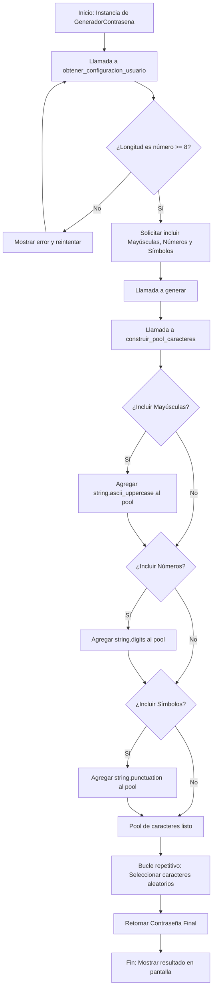

# Generador de Contraseñas Seguras

Este proyecto es una aplicación de consola desarrollada en Python que permite generar contraseñas robustas y personalizadas. Aplicando principios de **Programación Orientada a Objetos (POO)** y **Clean Code**.

## Requisitos
* Python 3.6 o superior.
* No requiere librerías externas (usa bibliotecas estándar).

## Instalación y Ejecución

1. **Clonar el repositorio:**
```bash
git clone https://github.com/IsRengel/password-generator-py.git
```
2. **Navegar al directorio del proyecto:**
```bash
cd password-generator-py
```

3. **Ejecutar la aplicación:**
    
- En **Windows**:
        
``` bash
python main.py
```
- En **Linux/macOS**:
``` bash
python3 main.py
```     

## Funcionalidades

- Validación de longitud mínima (8 caracteres).
    
- Selección opcional de mayúsculas, números y símbolos.
    
- Estructura modular basada en clases para facilitar el mantenimiento.
    
- Diccionario de configuración para soporte multi-idioma sencillo.
    

## Arquitectura y Lógica

El flujo lógico del programa se basa en la recolección de parámetros de seguridad del usuario, la construcción de un "pool" de caracteres permitido y la selección aleatoria mediante bucles repetitivos.

### Diagrama de Flujo



> **Nota:** Si se desea visualizar el diagrama como imagen, se encuentra en el archivo `code-flow.png` dentro del directorio `docs/workflows/`.

## Tecnologías utilizadas

- **Lenguaje:** Python 3
    
- **Librerías:** `random`, `string`
    
- **Documentación:** Docstrings (estándar de Google/NumPy)
    
- **Tipado:** Type Hinting para mayor legibilidad y depuración.

## Documentación

- [clean code](https://elhacker.info/manuales/Lenguajes%20de%20Programacion/Codigo%20limpio%20-%20Robert%20Cecil%20Martin.pdf)
- [docstrings](https://google.github.io/styleguide/pyguide.html#Comments)
- [mermaid](https://mermaid.dev/)