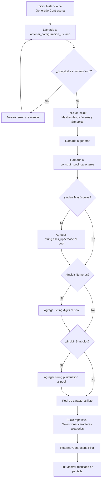

# Proyecto Integrador: El impacto de las nuevas tecnologías en la sociedad

## Universidad Internacional del Ecuador (UIDE)

**Asignatura:** Lógica de Programación

**Facultad:** Universidad Internacional del Ecuador - UIDE

**Estudiante:** Josue Ismael Avendaño Rengel

**Fecha:** Febrero 2026

---

## Descripción del Proyecto

Este software es una herramienta de ciberseguridad desarrollada en el lenguaje Python para la generación de contraseñas robustas. El proyecto busca analizar el impacto de las nuevas tecnologías en la privacidad ciudadana y proponer soluciones técnicas que mitiguen los riesgos de vulnerabilidad de identidad en el entorno digital futuro.

## Objetivo del Programa

Desarrollar una aplicación funcional que integre los conocimientos de las cuatro unidades de la asignatura (Algoritmos, Estructuras de Control, Estructuras Repetitivas y Programación Funcional/Orientada a Objetos) para proponer herramientas prácticas de protección de datos.

## Requisitos e Instalación

- **Requisitos:** Python 3.6 o superior.
    
- **Clonación del repositorio:**

```bash
git clone https://github.com/IsRengel/password-generator-py.git
cd password-generator-py
```
    
- **Ejecución del sistema:**
    
    - Sistemas Windows: `python main.py`
        
    - Sistemas Linux/macOS: `python3 main.py`

## Funcionalidades Principales

1. **Validación de Parámetros:** Restricción de longitud mínima de 8 caracteres para garantizar entropía (Unidad 3).
    
2. **Personalización de Caracteres:** Inclusión selectiva de mayúsculas, valores numéricos y símbolos especiales (Unidad 2).
    
3. **Generación Aleatoria Automática:** Implementación de lógica de selección azarosa mediante estructuras de repetición (Unidad 3).
    
4. **Arquitectura Modular:** Organización del código fuente mediante clases y funciones con paso de parámetros y retorno de valores (Unidad 4).
    

## Análisis de Software y Arquitectura

El sistema emplea el paradigma de Programación Orientada a Objetos (POO) para garantizar la escalabilidad y el mantenimiento del código. Se han implementado Type Hinting y Docstrings siguiendo los estándares de la industria para asegurar la legibilidad técnica.

### Diagrama de Flujo de la Lógica Integrada



> **Nota:** Si se desea visualizar el diagrama como imagen, se encuentra en el archivo `code-flow.png` dentro del directorio `docs/workflows/`.

## Tecnologías y Estándares Utilizados

- **Lenguaje de Programación:** Python 3
    
- **Principios de Diseño:** Clean Code (Código Limpio)
    
- **Documentación:** Docstrings bajo el estándar de Google
    
- **Modelado de Procesos:** Mermaid.js

## Documentación

- [clean code](https://elhacker.info/manuales/Lenguajes%20de%20Programacion/Codigo%20limpio%20-%20Robert%20Cecil%20Martin.pdf)
- [docstrings](https://google.github.io/styleguide/pyguide.html#Comments)
- [mermaid](https://mermaid.dev/)

---

_Este proyecto constituye la entrega final del Proyecto Integrador, cumpliendo con los objetivos académicos de las ocho semanas de instrucción._